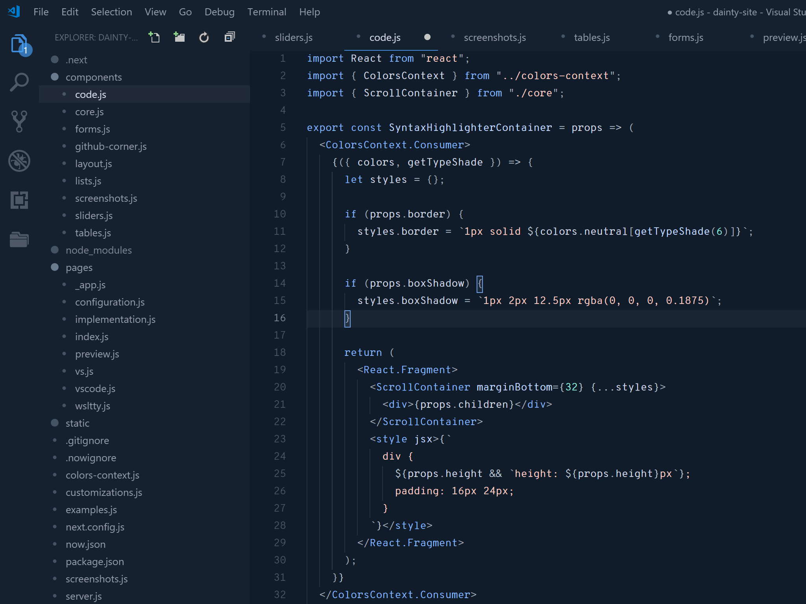
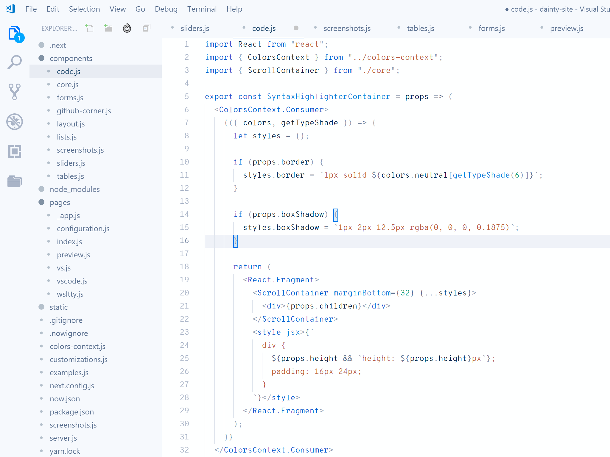

# Dainty for Visual Studio Code

Dainty is a color theme generator with support for Visual Studio Code. Dainty Light and Dainty Dark are the default presets. They’re balanced and refined color themes, using carefully selected colors within the Lab color space. Dainty also comes with popular themes as presets – such as Night Owl – or even things like the branding colors of Prettier.

See https://dainty.site/vscode for more information.

## Get Dainty through Visual Studio Marketplace

Get pre-built presets through the Visual Studio Marketplace. Search for “Dainty”. The following presets are included:

- Dainty Dark
- Dainty Dark Minimal
- Dainty Light
- Ayu Mirage
- Cobalt2
- Dark+
- Dracula
- Fluent
- Material Theme Ocean
- Material Theme Palenight
- Material Theme
- Minimal
- Monokai Night
- Monokai
- Night Owl
- Oceanic Next
- One Dark Pro
- Prettier
- Purple Haze
- Snazzy Theme
- Tomorrow Night Eighties

## Configure and build Dainty

### Setup

    git clone https://github.com/alexanderte/dainty-vscode.git
    cd dainty-vscode
    yarn

### Build and install

    yarn build -i

The `build` script, when run with `-i` or `--install` sets objects `workbench.colorCustomizations` and `editor.tokenColorCustomizations` in your `settings.json` to Dainty.

### Configuration

See https://dainty.site/configuration for more information.

## License

Dainty is licensed under the [MIT License](https://github.com/alexanderte/dainty-vscode/blob/master/license.md).
