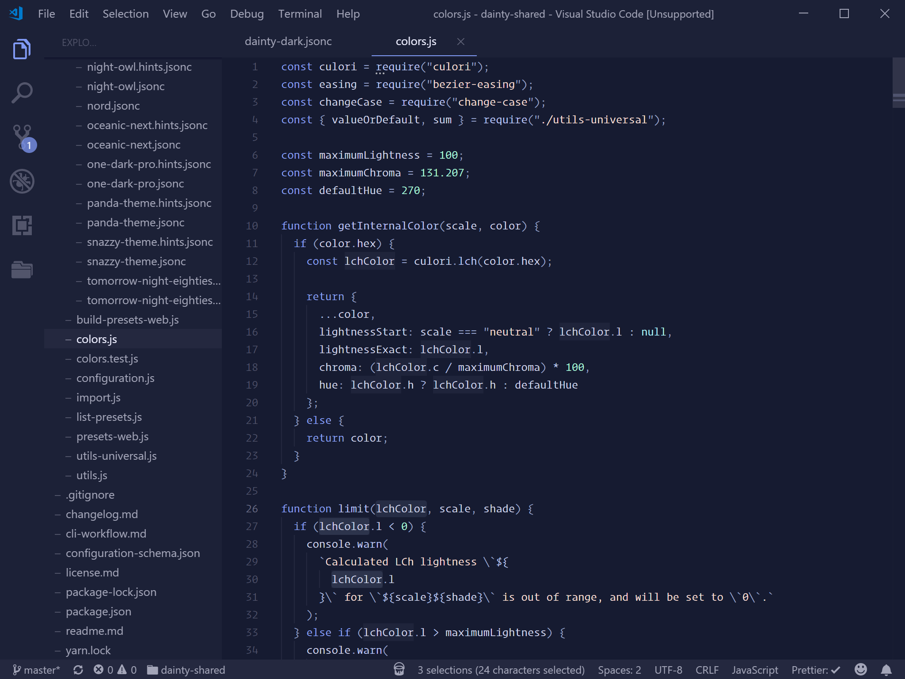
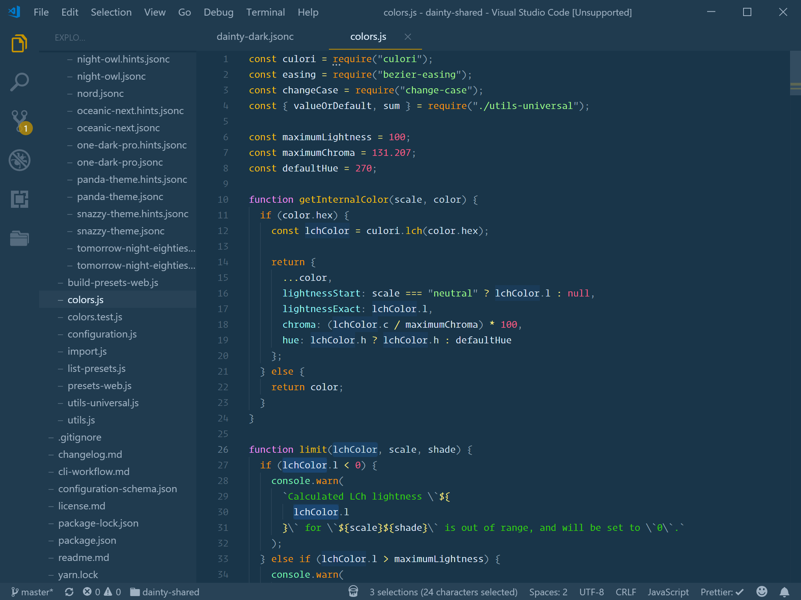

# Dainty for Visual Studio Code

Dainty is a **color theme generator** with support for **Visual Studio Code**. It comes with default presets **Dainty Dark** and **Dainty Light** as well as **popular color themes** as its presets.

## Features

- Colors are processed, and can be adjusted, within the Lab color space
- Punctuation marks are slightly dimmed
- Workbench is less busy than in the default/original themes

## Presets

### Dainty Dark (`dainty-dark`)

### Dainty Light (`dainty-light`)

### Cobalt2 (`cobalt2`)

### Dracula (`dracula`)

### Night Owl (`night-owl`)

### One Dark Pro (`one-dark-pro`)

### Palenight (`palenight`)

### Prettier (`prettier`)

## Additional presets

- Ayu Mirage (`ayu-mirage`)
- Dainty Dark Minimal (`dainty-dark-minimal`)
- Dark+ (`dark-plus`)
- Fluent (`fluent`)
- Material Theme Ocean (`material-theme-ocean`)
- Material Theme (`material-theme`)
- Minimal (`minimal`)
- Monokai Night (`monokai-night`)
- Monokai (`monokai`)
- Oceanic Next (`oceanic-next`)
- Purple Haze (`purple-haze`)
- Snazzy Theme (`snazzy-theme`)
- Tomorrow Night Eighties (`tomorrow-night-eighties`)

## Get it

The easiest way to get Dainty is to install it through **Extensions in Visual Studio Code**. Search for “dainty”.

## Build it

    git clone https://github.com/alexanderte/dainty-vscode.git
    cd dainty-vscode
    yarn

### Install theme into your `settings.json`

    yarn build -i -p dainty-dark

### Configuration

See https://dainty.site/configuration for more information.

## License

Dainty is licensed under the [MIT License](https://github.com/alexanderte/dainty-vscode/blob/master/license.md).
